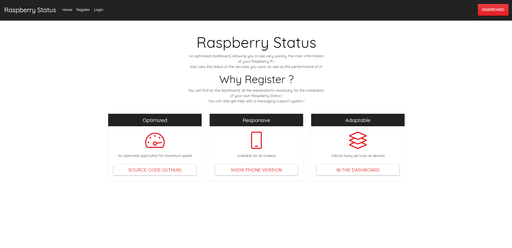

# 🍇 Raspberry Status

> Welcome to my Github! You will find on this directory, An optimized dashboard, allowing you to see very quickly, the main information of your Raspberry Pi !
  Also view the status of the services you want, as well as the performance of it !

> For the moment, only the design is available!

- The Model-View-Controller (MVC) is an architectural pattern that separates an application into three main logical components: the model, the view, and the controller. Each of these components are built to handle specific development aspects of an application. MVC is one of the most frequently used industry-standard web development framework to create scalable and extensible projects.

### 🔍 Show App

### 🛠️ Installation

- All the `code` required to get started

### 🔧 Setup (Not Availible Now)

- Go to the `'/_config'` folder and the `'config.php'` file

- In this one, go to `'Database Infos'`

- Edit the information, so you can connect to your database.

- `Save` it, and try to `refresh` your page.

### 📌 Support

- Website at <a href="https://kyliandev.fr" target="_blank">`kyliandev.fr`</a>
- Twitter at <a href="http://twitter.com/KylianDev_" target="_blank">`@KylianDev_`</a>

### 🔒 License

- This structure can be resumed, and modified.
- No rights are deposited.